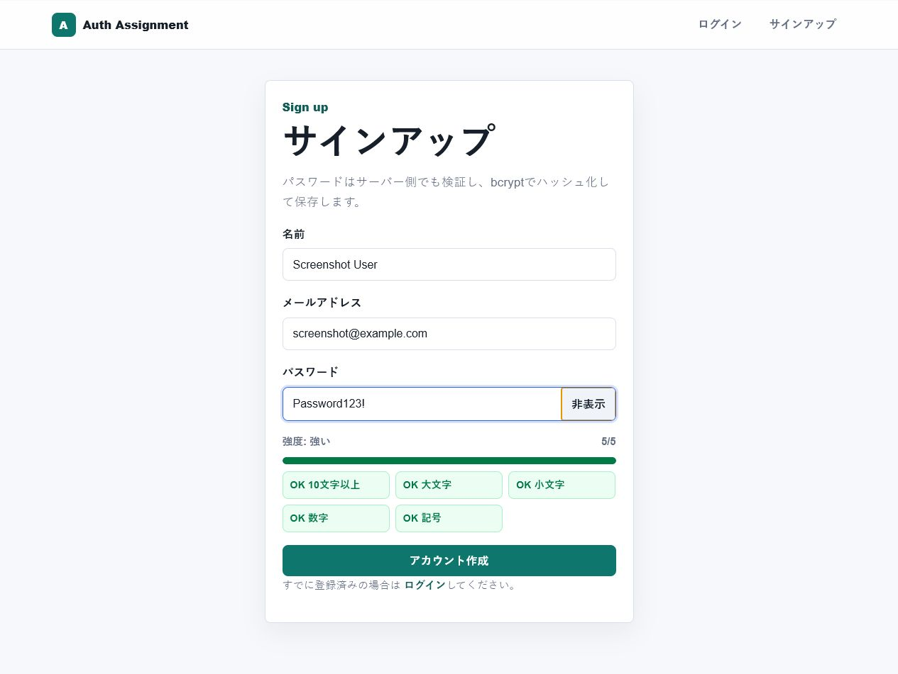

# Auth Assignment App

Next.js / TypeScript で作成した、認証・認可課題用のWebアプリです。

セッションベース認証を採用し、Prisma ORM + PostgreSQL にユーザー、セッション、ログイン試行履歴を保存します。サインアップ、ログイン、ログアウトに加えて、パスワード強度表示、パスワード表示切り替え、ログイン試行制限、Remember me、アクティブセッション管理、管理者向けユーザー管理を実装しています。

## 使用技術

- Next.js 15 App Router
- TypeScript
- React 19
- Prisma ORM
- PostgreSQL
- bcryptjs
- zod
- ESLint / TypeScript / Node test

## ローカル起動方法

1. 依存関係をインストールします。

```bash
npm install
```

2. `.env.example` を `.env` にコピーします。

```bash
copy .env.example .env
```

3. PostgreSQL を起動します。Dockerが使える場合は同梱の `compose.yaml` を使えます。

```bash
docker compose up -d db
```

4. Prisma Clientを生成し、マイグレーションを適用します。

```bash
npm run db:generate
npm run db:migrate
```

5. デモアカウントを作成します。

```bash
npm run seed
```

6. 開発サーバーを起動します。

```bash
npm run dev
```

ブラウザで `http://localhost:3000` を開きます。

## 本番ビルド

```bash
npm run build
npm run start
```

`DATABASE_URL` が必要です。ローカルでは `.env` に、VercelではプロジェクトのEnvironment Variablesに設定してください。

## Vercel デプロイ手順

SQLiteやローカルJSONファイルはVercelの本番環境では永続化に向かないため、このリポジトリはPostgreSQL前提にしています。

推奨手順:

1. Vercelでプロジェクトを作成し、このGitHubリポジトリをImportする
2. Vercel Storage / Marketplace で Prisma Postgres、または Neon / Supabase などのPostgreSQLを作成する
3. VercelのEnvironment Variablesに `DATABASE_URL` を設定する
4. VercelのBuild Commandを次に設定する

```bash
npm run vercel-build
```

5. デプロイする
6. デモ用管理者が必要な場合は、ローカル端末から本番DBの `DATABASE_URL` を指定して `npm run seed` を一度だけ実行する

注意: `npm run seed` はデモアカウントをupsertします。既存の一般登録ユーザーは削除しませんが、デモアカウントのパスワードと状態は初期値に戻します。

## テスト用アカウント

`npm run seed` 実行後に使えます。

一般ユーザー:

```text
email: user@example.com
password: Password123!
```

管理者:

```text
email: admin@example.com
password: AdminPassword123!
```

## 認証方式

セッションベース認証です。

- ログイン成功時にランダムなセッショントークンを発行
- Cookieにはトークン本体を保存
- PostgreSQLにはトークンのSHA-256ハッシュのみ保存
- Cookieは `HttpOnly`, `SameSite=Lax`, `path=/`, `expires` を設定
- production環境では `Secure` を有効化
- 通常セッションは2時間、Remember me有効時は30日

## Prisma データモデル

主なテーブル:

- `User`: ユーザー、bcrypt済みパスワード、ロール、停止状態、ログイン失敗回数
- `Session`: ハッシュ化済みセッショントークン、期限、最終利用日時、失効日時
- `LoginAttempt`: メールアドレス/IP単位のログイン失敗回数とロック期限

マイグレーションは `prisma/migrations/20260626000000_init/migration.sql` に含めています。

## 実装した認証・認可機能

### 1. パスワード強度表示

サインアップ画面でパスワード入力中にリアルタイムで強度を表示します。

評価項目:

- 10文字以上
- 大文字
- 小文字
- 数字
- 記号

弱い場合は不足している条件を改善点として表示します。サーバー側でも同じ基準で検証し、弱いパスワードでは登録できません。

確認方法:

1. `/signup` を開く
2. `abc` など弱いパスワードを入力する
3. 強度が低く、不足条件が表示されることを確認する
4. `Password123!` を入力し、5項目すべてがOKになることを確認する



### 2. パスワード表示・非表示切り替え

ログイン画面とサインアップ画面のパスワード欄に表示切り替えボタンを追加しました。

確認方法:

1. `/login` または `/signup` を開く
2. パスワードを入力する
3. `表示` ボタンを押す
4. 入力欄が `type=password` から `type=text` に切り替わることを確認する
5. `非表示` ボタンで再び隠れることを確認する

### 3. ログイン試行回数制限

短時間にログイン失敗を繰り返すと、一定時間ログインを制限します。

仕様:

- メールアドレス単位とIP単位で失敗回数をPostgreSQLへ記録
- 10分以内に5回失敗すると5分間ロック
- ロック中はわかりやすいエラーメッセージを表示
- 管理者画面からユーザーのメール単位ロックを解除可能

確認方法:

1. `/login` を開く
2. `user@example.com` に対して誤ったパスワードを複数回入力する
3. ロック後に「約5分後に再試行してください」というメッセージが表示されることを確認する
4. 管理者でログインし、ユーザー管理画面からロック解除できることを確認する


### 4. Remember me

ログイン画面に「ログイン状態を保持する」チェックボックスを追加しました。

仕様:

- チェックなし: 2時間の通常セッション
- チェックあり: 30日の長期セッション
- ダッシュボードにセッション期限と Remember me 状態を表示

確認方法:

1. `/login` を開く
2. 「ログイン状態を保持する」にチェックを入れる
3. ログインする
4. `/dashboard` で「Remember me 有効」と、通常より長い期限が表示されることを確認する


### 5. アクティブセッション一覧・個別ログアウト

ログイン中のユーザーは `/sessions` で自分のアクティブセッションを確認できます。

表示項目:

- 作成日時
- 最終利用日時
- 有効期限
- IPアドレス
- User-Agent
- Remember me の有無
- 現在のセッションかどうか

各セッションの `ログアウト` ボタンで個別に無効化できます。現在のセッションを無効化した場合はCookieも削除され、ログイン画面へ遷移します。

確認方法:

1. ログインする
2. `/sessions` を開く
3. 現在のセッション表示、作成日時、最終利用日時を確認する
4. `ログアウト` ボタンを押す
5. `/login` に戻ることを確認する


### 6. 管理者ユーザー管理

管理者だけが `/admin/users` にアクセスできます。

実装内容:

- ユーザー一覧表示
- アカウント停止
- アカウント停止解除
- ログインロック解除
- 停止ユーザーの既存セッション無効化
- 一般ユーザーは画面にもサーバーアクションにもアクセス不可

確認方法:

1. `admin@example.com` でログインする
2. `/admin/users` を開く
3. ユーザー一覧が表示されることを確認する
4. 一般ユーザーの `停止` を押し、状態が `停止中` になることを確認する
5. `停止解除` で再び有効化できることを確認する
6. `user@example.com` でログインし、`/admin/users` に直接アクセスしても `/dashboard` に戻されることを確認する


## セキュリティ上の工夫

- パスワードは平文保存せず、bcryptでハッシュ化
- 認証Cookieは `HttpOnly` にしてクライアントJavaScriptから読めないように設定
- セッショントークン本体はDBに保存せず、SHA-256ハッシュのみ保存
- Cookieに明示的な有効期限を設定
- production環境ではCookieの `Secure` を有効化
- 入力値はサーバー側で zod により検証
- サインアップ時のパスワード強度はクライアント表示だけでなくサーバー側でも検証
- 管理者機能はページ表示とサーバーアクションの両方でロール確認
- 停止ユーザーの既存セッションは無効化
- ログイン失敗時は内部情報やスタックトレースを表示しない
- セッション一覧はログイン中ユーザー自身のセッションだけを表示

## 主なルーティング

- `/` ホーム
- `/signup` サインアップ
- `/login` ログイン
- `/dashboard` 認証済みユーザー用ダッシュボード
- `/sessions` アクティブセッション一覧
- `/admin/users` 管理者ユーザー管理

## チェックコマンド

```bash
npm run lint
npm run typecheck
npm test
npm run build
npm audit --omit=dev
```

## 既知の制限・未実装事項

- Vercelにデプロイする場合は、Vercel外部またはVercel連携のPostgreSQLが必要です。
- メール認証、パスワードリセット、多要素認証は未実装です。
- IPアドレス取得は `x-forwarded-for`, `x-real-ip` に対応していますが、本番ではプロキシ設定と合わせて検証が必要です。
- Cookie署名ではなく、十分長いランダムトークンとDB側ハッシュ照合でセッションを管理しています。
