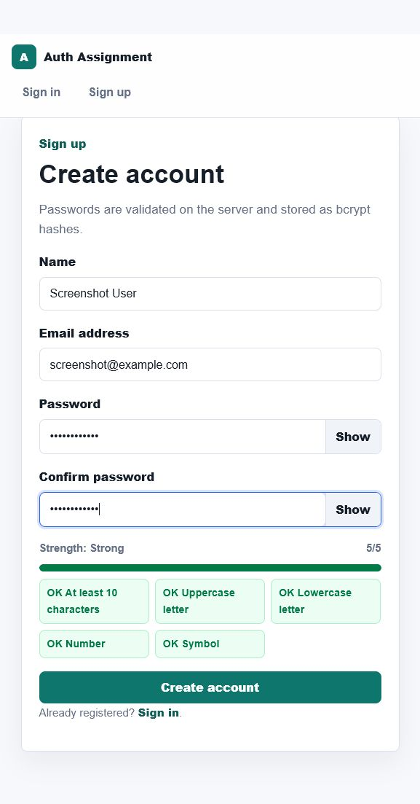
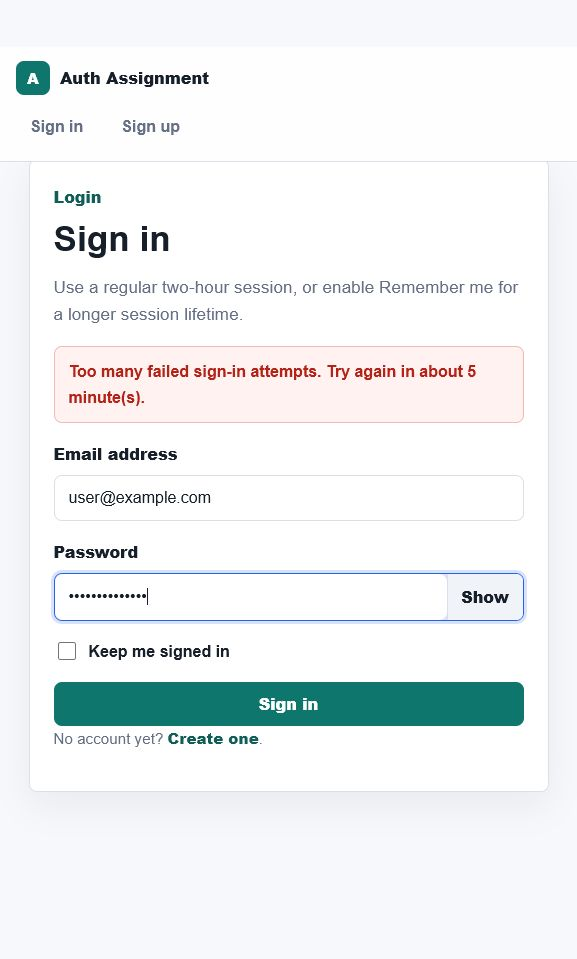
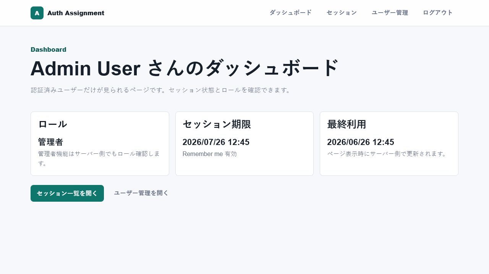
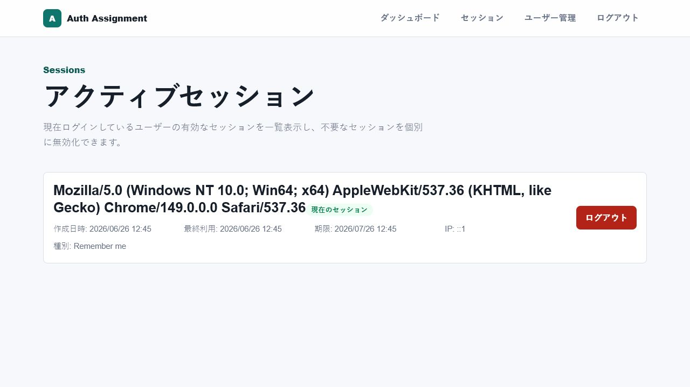
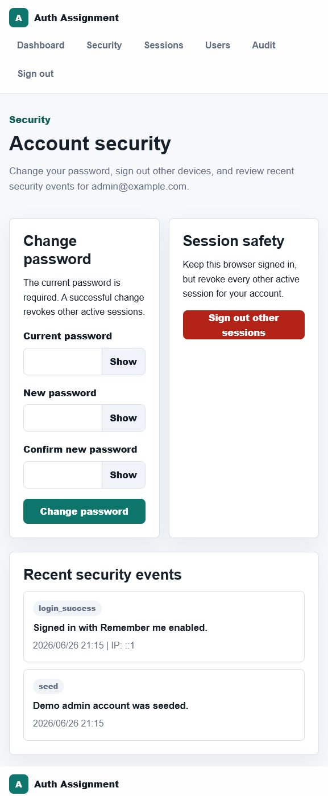
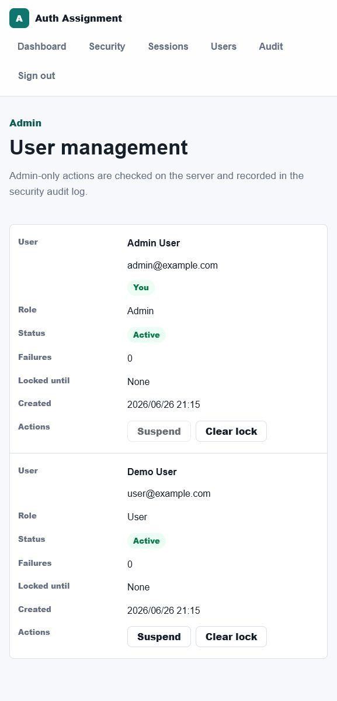
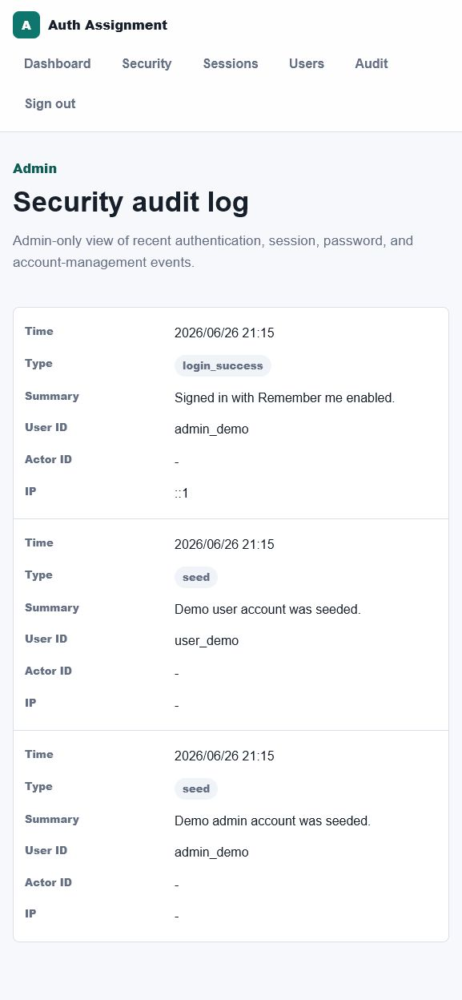

# Auth Assignment App

Web: https://auth-app-lyart-omega.vercel.app

Next.js / TypeScript で作成した、セッションベース認証のWebアプリです。サインアップ、ログイン、セッション管理、パスワード変更、管理者向けユーザー管理、監査ログまでをひとつの小さなアプリとしてまとめています。

## Overview

ユーザーはメールアドレスとパスワードでアカウントを作成し、ログイン後に自分のセッションやセキュリティイベントを確認できます。管理者はユーザー一覧、アカウント停止、ロック解除、監査ログ確認を行えます。

認証はサーバー側で検証し、セッションはHttpOnly CookieとDB上のトークンハッシュで管理しています。ローカルではSQLite、VercelではPostgreSQLを使う構成です。

## Features

- メールアドレスとパスワードによるサインアップ / ログイン
- bcryptによるパスワードハッシュ化
- HttpOnly Cookieを使ったセッション認証
- Remember meによるセッション有効期限の切り替え
- パスワード強度メーター
- パスワード表示 / 非表示切り替え
- サインアップ時の確認用パスワード
- ログイン失敗回数制限と一時ロック
- アクティブセッション一覧と個別ログアウト
- 現在のパスワード確認付きパスワード変更
- 他セッション一括ログアウト
- ユーザー別セキュリティイベント履歴
- 管理者専用のユーザー管理
- 管理者専用の監査ログ
- OriginチェックによるCSRF対策
- セキュリティヘッダー設定

## Screenshots

### Sign Up



### Login Lockout



### Dashboard



### Sessions



### Security Settings



### Admin Users



### Admin Audit



## Tech Stack

- Next.js 15 App Router
- React 19
- TypeScript
- Prisma ORM
- PostgreSQL on Vercel
- SQLite for local development
- bcryptjs
- zod
- ESLint
- Node.js test runner

## Authentication Design

このアプリはセッションベース認証です。

- ログイン時にランダムなセッショントークンを生成します。
- Cookieには生のセッショントークンを保存します。
- DBにはセッショントークンのSHA-256ハッシュだけを保存します。
- Cookieは`HttpOnly`、`SameSite=Lax`、`path=/`、有効期限付きで設定します。
- Vercel上ではCookieに`Secure`が付きます。
- 通常セッションは2時間、Remember meセッションは30日有効です。
- セッションはサーバー側で毎回検証し、失効済み・期限切れ・停止ユーザーのセッションは拒否します。

## Security Notes

- パスワードは平文保存せず、bcryptでハッシュ化しています。
- サーバー側でzodによる入力検証を行います。
- 管理者画面と管理者操作はサーバー側でroleを確認します。
- ログイン失敗はメールアドレス単位とIPアドレス単位で記録します。
- パスワード変更時は他のアクティブセッションを無効化します。
- アカウント停止時は対象ユーザーのアクティブセッションを無効化します。
- 状態変更を行うServer ActionではOriginとHostの一致を確認します。
- 内部エラー、秘密情報、トークンを画面へ露出しないようにしています。
- 認証イベントや管理者操作は監査ログとして記録します。

## Main Routes

- `/` ホーム
- `/signup` サインアップ
- `/login` ログイン
- `/dashboard` ダッシュボード
- `/security` セキュリティ設定とイベント履歴
- `/sessions` アクティブセッション管理
- `/admin/users` 管理者向けユーザー管理
- `/admin/audit` 管理者向け監査ログ

## Demo Accounts

ローカルで`npm run local:setup`を実行すると、次のデモアカウントが作成されます。

```text
User:
email: user@example.com
password: Password123!

Admin:
email: admin@example.com
password: AdminPassword123!
```

Vercel側のデモアカウントは、Vercel上のPostgreSQLに対して作成したユーザーを管理者化して使います。環境ごとにDBが分かれるため、ローカルのデモアカウントはVercel上には自動反映されません。

## Local Development

```bash
npm install
copy .env.example .env
npm run local:setup
npm run build
npm run start
```

ローカルURL:

```text
http://localhost:3000
```

`npm run local:setup` はSQLite DBを初期化し、Prisma ClientをSQLite用に生成してからデモアカウントを作成します。

## Vercel Deployment

VercelではPostgreSQLを使用します。Vercel StorageやNeon、SupabaseなどでPostgreSQLを作成し、Project SettingsのEnvironment Variablesに次を設定します。

```text
DATABASE_URL=postgresql://...
```

`vercel.json`でBuild Commandを固定しています。

```bash
npm run vercel-build
```

実行内容:

```bash
prisma generate && prisma migrate deploy && next build
```

これにより、デプロイ時にPrisma Client生成、migration適用、Next.js buildが実行されます。

## Commands

```bash
npm run local:setup
npm run lint
npm run typecheck
npm test
npm run build
npm audit --omit=dev
```

## Notes

- メール認証、パスワードリセット、多要素認証は未実装です。
- ローカルはSQLite、VercelはPostgreSQLを使うため、データは環境ごとに独立しています。
- CSPはNext.jsの動作に必要な範囲で`unsafe-inline` / `unsafe-eval`を許可しています。より厳密にする場合はnonceベースのCSPにできます。
